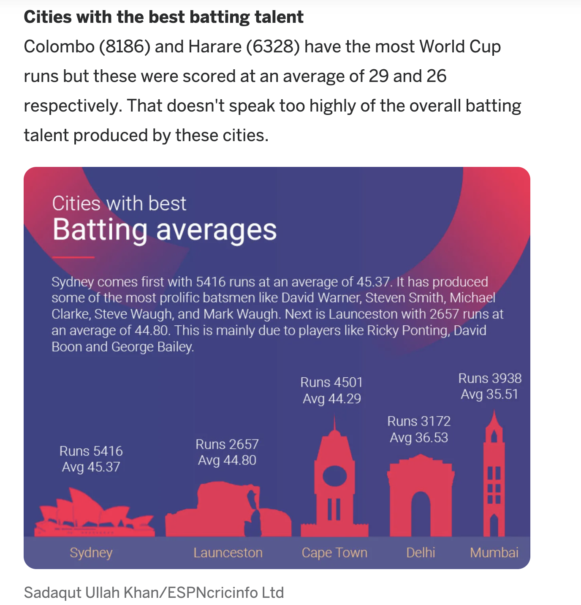

# Critique by Design
>  The data source of the chart is recreated from [here](https://runrepeat.com/your-city-cricket-world-cup-rankings).  

## Original data visualization from ESPNcricinfo
  
This data visualization is captured from [here](https://www.espncricinfo.com/story/which-top-cricket-city-would-win-the-world-cup-1196522).  
  
## Step-by-Step Redesigning Process
#### Redesign sketch 1 and 2
Before starting to redesign, I thought about the effectiveness of the data visualization according to the google form filled out in class. I believe the primary audiences are those who are interested or who cared about cricket games. Though the original visualization is useful for them, but the design can lead to misleading information. It is trying to tell some important data values but the way it shows will make people focus more on the shapes of the cities rather than the data, hence it will be useless. The visualization has all the data for people to understand what it is trying to tell, it is understandable but also includes some inrelevant data and is showing too much text. At the same time, the cities with taller buildings and pictures doesn't mean it have a higher average. Summarizing my opinion above, I think it is unclear and difficult to understand with minimal effort.  
##### Sketch 1
  
##### Sketch 2
  
In the two sketches I drew, I tried to change the type of visualization into bar charts to make it simple and easy for users to know the top cities of batting averages in cricket games. As I think the original color of the visualization is distracting and unfriendly to the eyes, I also changed the color and only highlight the one that has the highest data.  
  
#### Feedbacks on sketch 1 and 2
Two interviews were conducted for feedbacks.  
Interviewees information:  
Student A, 23 years old  
Student B, 29 years old  
  
- Can you tell me what you think this chart is about and what is it telling you?  
A:  When I look at the second chart, then I know it is talking about the batting average of cities that plays cricket games.  
B: From the title of the second chart I inspect that the the chart is trying to show the top cities with high batting averages in cricket games. And I guess it also shows the total runs?  
  
- Is there anything you find surprising or confusing?  
A: If I only look at the first chart, I will think it is a graph about some places that play baseball as it mentioned "Batting averages" and "runs". So it can be confusing and misleading if you don't mention cricket games anywhere in the chart.  
B: Since I don't have an idea of how the batting average is calculated, the "runs" is confusing as I try to connect it with the batting average information.  
  
- Who do you think is the intended audience for this?  
A: I think it is for people who knows cricket games? Since most of the cities aren't those that we usually think about when it comes to some major sports played these days.  
B: If the title is clear enough, I think anyone who is reading this graph in news or websites can understand the graph. But maybe people who watch cricket will be more familiar with the data.  
  
- Is there anything you like or would change or do differently?  
A: I don't know is "runs" necessary to be shown in the chart since you may just want to focus on the batting averages. Neither connecting it with the lines nor showing the runs data is meaningless. And you might want to show the accurate number on the top of each bar.  
B: The legends on the first chart may appear small, so maybe you will want to show them in the bar? (Or maybe you can rotate the chart). But I like how the color is highlighted in the second graph.  
  
#### Redesign sketch 3
Based on the feedbacks, I came up with the following sketch 3 redesign.  
##### Sketch 3

First of all, the title  is renamed so that audiences can catch what the chart is about at first glance. Then I also flipped the data on the x axis and y axis as I think in this way the label of the cities can be shown in the clearest way. I also removed the "Runs" value since it is unnecessary information in this visualization. At the mean time, I add the label of the values at the end of each bar so that the users can know the value at first glance.  
  
#### Feedbacks on sketch 3
After sketching the third redesigned visualization, I showed it to the two interviewees and asked for feedbacks again.  
Here is what they said:  
A: Overall, looks good to me! I am thinking will it be better if you tell where the cities are located? I think in that way it will be more user friendly to most audiences like me who may not know cricket games well.  
B: I recommend still highlighting the color of the top first city so that there is a difference between number 1 and the others, though you only show the top 10. And you might want to keep the label for the batting averages but remove the label for "Cities" since it is redundant.  
  
#### Feedbacks from in-class group
They liked the final redesign overall, but they couldn't understand why the highest batting average city needs a different color. 

#### Final redesign
According to the feedbacks, I modified the chart again and came up with the final redesign visualization using Flourish showed in the next section. This time, I added the countries of the cities according to interviewee 1's suggestion. The colors are also altered with the top first city highlighted. Most cricket balls are in red color, but I believe using a red can be harmful to the eyes when viewing, so I picked a more muted light red color and use a light blue for the highlighted city. I still kept the different color but changed the title from "Cities with Top 10 Batting Average in Cricket games" to "Cities' Cricket Batting Average" of the chart to focus more on the highest value.

 After receiving the feedbacks, I was grateful to know that there are still improvements that I can make to make the visualization more useful. Though I may be satisified at the beginning, as the advices came in, I could think more thoroughly and redesign. Although no visualization can suit all audiences tastes, it was a great experience to modify my charts based on the opinions the interviewees gave me.

## Final redesigned data visualization

[Return to Portfolio](https://andreywc.github.io/94870-portfolio/)
