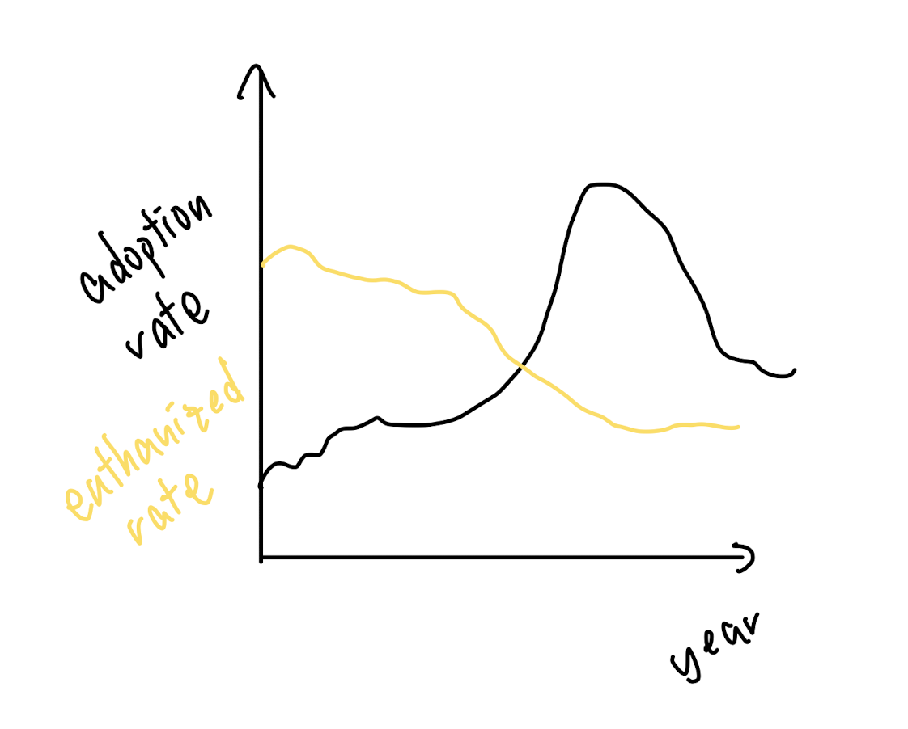
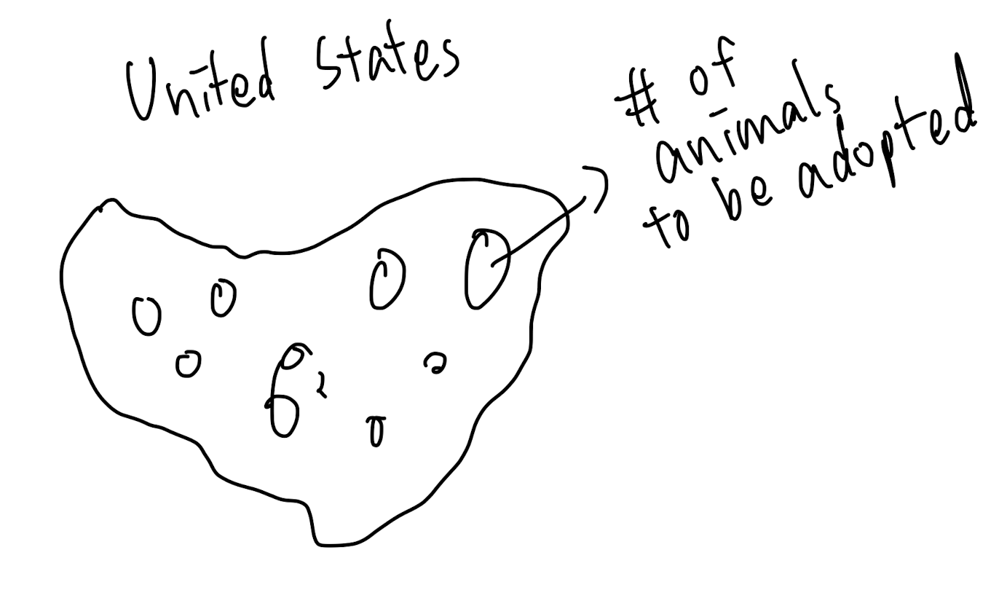
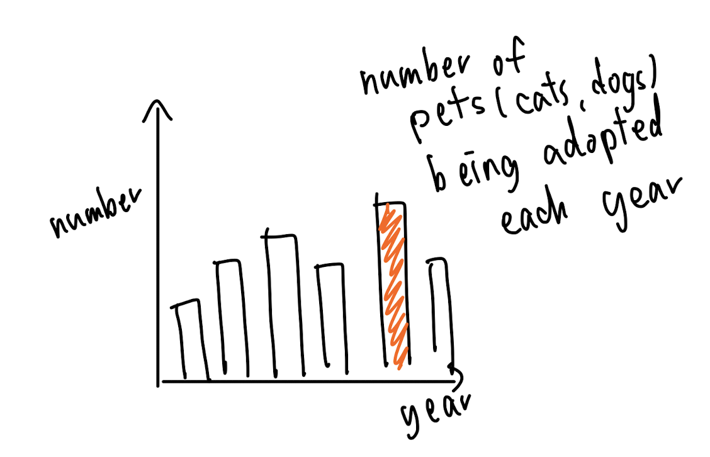

# Final Project 
> *The project progress will be divided into three parts.*  
* [Part I](https://andreywc.github.io/94870-portfolio/final_project_andrey_chang.html#part-i)  
* [Part II](https://andreywc.github.io/94870-portfolio/final_project_andrey_chang.html#part-ii)
  
## Part I
### Outline  
The debate of euthanasia of animals has continued for decades. In this project, I hope to persuade the audience to adopt animals instead of purchasing them to lower the euthanize rate. Adoption should be taken more seriously as thousands of pets are waiting for a new home. I want to tell more about the reasons why pets can be in the shelters, and in what condition will they face the scenario of being euthanized. 

Story Arc:
* Adoption rate needs to be increased to save more pets from being homeless and euthanized.
* As a reader, I want more knowledge to understand how much pets are to be adopted or what can I do to help.
* I can do this by adopting a pet instead of purchasing one when I am interested.
### Sketches
A line chart showing the adoption rate and the euthanized rate.  
  
A map showing number of pets waiting to be adopted.  
  
A bar chart showing the number of pets being adopted each year.  
  

### Data  
The data source is from :
1. [Kaggle](https://www.kaggle.com/datasets/jackdaoud/animal-shelter-analytics)
2. [data.world](https://data.world/kingcounty/yaai-7frk) 
3. [Kaggle](https://www.kaggle.com/competitions/shelter-animal-outcomes/data)
4. [The Humane Society of the United States](https://humanepro.org/page/pets-by-the-numbers)
5. [ASPCA](https://www.aspca.org/helping-people-pets/shelter-intake-and-surrender/pet-statistics)
6. More to be found..
  
The data found different sites can show how much pets are in the shelters, waiting to be adopted. The plan is to generate a few visualization graphs from the datasets. I will try to show areas with their adoption rate and euthanized rate to see the correlation between them. Different graphs will be presented to give a more comprehensive understanding.
  
### Method and Medium  
This project is planned to be done by **Shorthand**. The page will include text, scrollmation, grid, and other functions provided by shorthand to demonstrate the topic. The mapping of the data will be accomplished in Tableau or Excel. The charts and graphs will be generated by Tableau to give a more clear idea of the story.

## Part II  
### Wireframe and Storyboard 
### User Research 

[Return to Portfolio](https://andreywc.github.io/94870-portfolio/)
