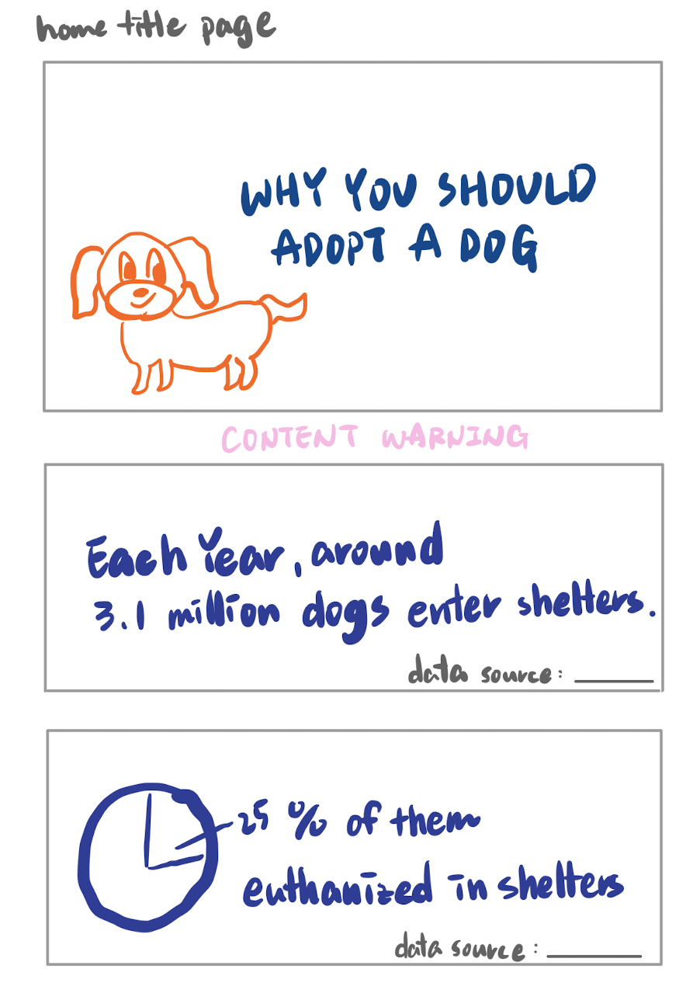
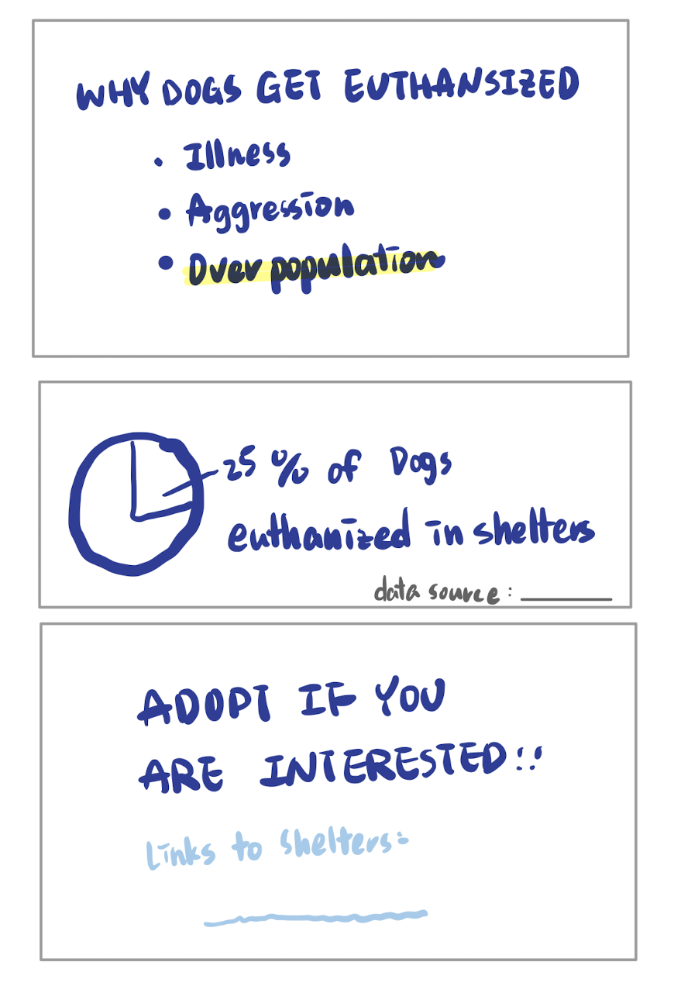

# Final Project 
> *The project progress will be divided into three parts.*  
* [Part I](https://andreywc.github.io/94870-portfolio/final_project_andrey_chang.html)  
* [Part II](https://andreywc.github.io/94870-portfolio/final_project_part2_andrey_chang.html#part-ii)
  
## Part II  
### Updated Story Outline 
#### Original Version in Part I
The debate of euthanasia of animals has continued for decades. In this project, I hope to persuade the audience to adopt animals instead of purchasing them to lower the euthanize rate. Adoption should be taken more seriously as thousands of pets are waiting for a new home. I want to tell more about the reasons why pets can be in the shelters, and in what condition will they face the scenario of being euthanized. 

* Story Arc:
  - Adoption rate needs to be increased to save more pets from being homeless and euthanized.
  - As a reader, I want more knowledge to understand how much pets are to be adopted or what can I do to help.
  - I can do this by adopting a pet instead of purchasing one when I am interested.
#### Updated Version
* Will be focusing on more about "adoption" instead of "euthansia" and "don't purchase" in the story, the two idea will still be mentioned, but is used to enhance the idea of adopting. 
* Will try to focus on the data of California, which has the highest euthansia rate among all states, to be more precise and narrow the story.

### Storyboard 
*The storyboard that shows how it will look like in Shorthand.*  
 
  
  
  
  
### User Research 
#### Target Audience
The target audience of this story should be but are not limited to those who are interested in keeping a dog in the future. The concept that I am trying to provide is to adopt them instead purchasing them. But for the other groups, including people who may have already adopted or shopped one, they could also fall in the story and decide to adopt dogs from the shelters in the future.  

#### Approach to Identifying Interviewees
I asked through social media to investigate if there is anyone who wants to have a dog in the future. Luckily, there are plenty of people who are willing to have a dog. I approached two of the respondents and identified another interviewee who is already raising a dog for a more thorough response from different categories.
* Interviewee A, 27 years old, no experience in raising pets, interested in adopting a dog
* Interviewee B, 24 years old, had a dog before, currently not interested in adopting a dog but continues to pay close attention about euthanasia issues
* Interviewee C, 48 years old, currently keeping two dogs that were adopted few years ago
   
#### Interview Script
Storyboard are showed without additional explaining, as I hope they can understand the story even without explanation.  
  
|     | Goals         | Questions           | 
|-----| ------------- | -------------       | 
|1.| To see whether the story is clear even without explanation | What do you think the story is trying to tell you? | 
|2.| To see if the thoughts of the data visualizations are able to be conveyed clearly | Are the data visualizations clear to you? | 
|3.| To make sure nothing is confusing | Is everything clear enough? Is there any topic or idea that seems unclear or vague?      | 
|4.| To see what may be appealing or distracting | Is there anything you particularly like or dislike?     | 
|5.| To understand points that I might ignored or should focus on | Any other thoughts?    | 
  
#### Interviewees' Responses
*Interviewee A*
  
|     | Responses | 
|-----| --------- | 
|1.   |You are trying to tell people to adopt a dog.|
|2.   |Yes, it is clear enough to me.|
|3.   |"Adopt if you are interested" that idea is pretty clear, especially when you leave it as a conclusion.|
|4.   |I like the dog on the home page. But I don't like how you mention euthanasia and then talking about why they are in shelters back again.|
|5.   |N/A|
  
*Interviewee B*
  
|     | Responses | 
|-----| --------- | 
|1.   |Adopting a dog|
|2.   |Why did you put California here? I don't get that part. But the graph itself is clear, just curious why California in all of a sudden..|
|3.   |opic is clear and you emphasized it in the end again, so I think there is enough information up there. But the idea talking about "Reasons", maybe you should think more about this. Why did you put it here and make it clear, don't just say reasons.|
|4.   |The dog icon? It's cute.|
|5.   |Content warning, that is something that I didn't expected when I first see the title page. Great to have it there.|
  
*Interviewee C*
  
|     | Responses | 
|-----| --------- | 
|1.   |Trying to persuade me to adopt a dog. Because you listed "Why" you should adopt instead of "How", so I guess the main idea is that you are trying to tell the benefits of adopting a dog.|
|2.   |Data visualizations itself is clear.|
|3.   |Yep, it is clear, it would be understandable even if you didn't talk about it but just let me see it.|
|4.   |Great eye catching on the first page with the dog and the last page with the strong words to tell people adopting if interested.|
|5.   |I'm not sure if it is only me that thinks so, but I feel like the order is kind of jumping around. Tell what is the warning about, don't just say content warning. Add labels to describe and make it clear. And the title, if it is a persuasive speech, then it works, but if you are telling me that you are trying to tell a story to call action, maybe you don't want to sound like debating with someone. And also, I think you should tell why dogs are euthanized, cause according to the story, I might think all dogs in the shelters will end up being euthanized if not adopted.|

#### Findings
* Consistent Feedbacks
  - Good Parts: 
    - It is pretty clear that the story is trying to tell people to adopt a dog.
    - Great idea to appeal people with the dog picture.
    - Call to action on the last page is good.
  - To Be Improved: 
    - The title of the home page, it doesn't seems that appealing and fells like I am trying to debate with someone.
    - Vague when talking about the reasons. Why did I mentioned reasons? What does the reasons here mean?
    - Things are clear, but maybe the order can be revised, like putting ideas about euthansia together

* Conflict Feedbacks
  - Visualizations are clear vs. Not sure why did I wrote California (Is there anything special about California?)
  - Information is enough vs. Not persuasive enough, especially if I mentioned the rate of dogs euthanized in shelters, this could be midleading 
  - Content warning label brings the attention vs. Add a subtitle under the content warning so audience knows what are you trying to warn
  
#### Changing Plans
From the feedbacks received from the interviewees, I feel like there is still a lack of information to tell the story.   
The following changes are planned to be made:  
1. New title to sound less aggressive. 
2. Include information about why the dogs are euthanized.
3. I was trying to simplify the story by only writing "Reasons", but because there are other information other than adopting in the storyboard, this further lead to a confusion. The plan is to change the order to see if it will be cleared.
4. The original sketch of the states will be added back, with a combination of the data of animals to be adopted and the euthansia rate, to tell why am I using the numbers of California.
5. Add subtitle to the content warning.  
  
#### New Version of Storyboard before in-class critique
  
  
  
  
  
For the first page, it will be the title, which is the main concept of the story that I am trying to tell. There will be a small interval of content warning as suggested to notify the audience there could be some sensitive information in the presentation. The second page is where I give a number of how many dogs enter the shelters each year, to catch the eye and also give an image of the numbers. The third page is about telling why the dogs are in the shelters and in the forth page, to call out the action, there will be reasons listed why we should adopt dogs. Lowering the euthanasia will be highlighted to inform that there will be information about that part in the following presentation. Then in the next page, I show the data visualization telling which state has the highest euthansia rate. In the sixth page, as California is the top listed state, the graph will show specific data of the adoption rate and euthanasia rate. In the seventh and eighth page, the story is trying to tell why dogs get euthanasia and give the number of how many dogs get euthanasia each year, giving the reason of why we should adopt them instead of shopping them to lower the possibilty of dogs getting euthanasia in shelters. In the final page, the presentaion ends with calling out the action and some links to the shelters will be provided.  
  
#### In-class Critique Feedbacks
* If possible, maybe I can try making a comparison before and after the COVID-19 pandemic. Since we believe the rates of adoption have huge changes due to various reasons.
* When talking about the reasons, try to make it like telling this story to all audiences instead of to those targeted ones.
* The data visualization of California showing the compare rates of adoption and euthanasia is good.
  
### Wireframe
*Data visualizations that will possibly be embedded.*  
  
  
  
   
  
#### Preview of Shorthand
[Shorthand Preview](https://preview.shorthand.com/9sXj2xUcInhLreBW) 
> Uncompleted, Still In progress 

[Return to Portfolio](https://andreywc.github.io/94870-portfolio/)

